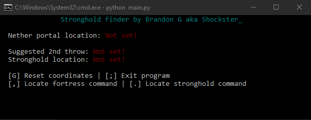
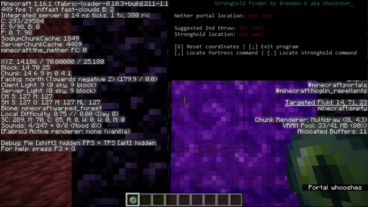
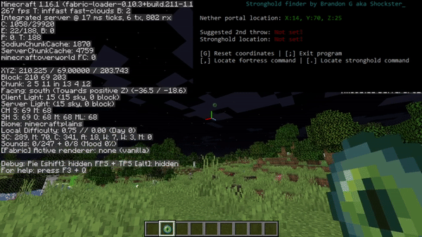

<h1 align="center">Stronghold Finder</h1>

My personal Minecraft Stronghold finding tool using a triangulation algorithm released for community use.

<h3 align="center">
  <a href="#About">About</a> •
  <a href="#Installation">Installation</a> •
  <a href="#Usage">Usage</a> •
  <a href="#FAQ">FAQ</a> •
  <a href="https://github.com/Shockster218/Stronghold_Finder/issues">Request Feature</a> •
  <a href="https://github.com/Shockster218/Stronghold_Finder/issues">Report Bug</a>
</h3>

# About
Slight modification of [@AlanTheBenign's stronghold finder](https://github.com/AlantheBenign/stronghold-finder) to read directly from the clipboard, which also reads nether coords. With a minimalist design approach, ease of use was a main priority targetted for speedrunning.

# Installation
To use the program visit the release page [Here](https://github.com/Shockster218/Stronghold_Finder/releases/). Simply download the .zip file and extract the folder to, for exmaple, your desktop. Once that is done, all you have to do is run "Stronghold Finder.exe" and the program should start!

  

# Usage
Using the program is extremely simple, follow these steps in-game:

## For nether

  Simply copy the coordinates (refer to handy shortcuts below) and that's it!
  

## For stronghold.

  Make sure you're in an open space with no obstacles within a 15 block radius of you. Once in position, throw your eye of ender. Locate where the eye flies to and simply
  copy the coordinates (refer to handy shortcuts below). <b>For best results, it is very important to aim in the center of the eye when copying the coordinates. The best way
  I have found to do this is to have the F3 menu open and align the green line of the crosshair with the center of the eye.</b>
   
   
  
   
  <i>Note: You can follow the angle given by the stronghold finder to get to the coordinates the fastest way possible.</i>
   
   
  Next, head to the suggested second throw coordinates displayed by the stronghold finder. In the off chance you're already a few thousand blocks out, you will not be given an exact throwing position but instead given a set of directions for your next throw. Simply follows those instead. Once there, simply throw the next eye of ender (also being in an open space) and copy the coordinates once more (refer to handy shortcuts below). <b>Again, it is   extremely import to be aimed directly in the center of the eye for best results. Use the trick mentioned before to do this.</b>
   
   
  
   
  <i>Note: You can follow the angle given by the stronghold finder to get to the coordinates the fastest way possible.*</i>
    
  And there you have it! Go to the coordinates displayed by the stronghold finder and dig down. If everything was done correctly, you should be directly in the center
  of the entrance staircase. Good luck!

 

## Handy shortcuts
- F3 + C (in that order): Copy coordinates to clipboard for the program.
- [G] Reset program coordinates.
- [;] Exits the program.
- [.] Locates Fortress. (in-game command only, cheats must be enabled!)
- [,] Locates Stronghold. (in-game command only, cheats must be enabled!)

See Also: [Editing program hotkeys.](#hotkey)

# FAQ 

### Why have an external program? Why not hook this directly into the client?
The reason this process is necessary is due to the guidelines and rules for speedrunning minecraft (found [here](https://docs.google.com/document/d/1A7NtP7LegD7SYjho54gQDSlJkYZlofndjw2COu00yMU/edit)). You are not allowed to modify or tamper with the code of the client in any shape or form.

### Is this allowed for speedrunning?
Directly quoted from the speedrunning discord

> Q: Is a stronghold finder allowed?

>A: Yes, but no. Any stronghold/structure finder website that asks for seed input is not allowed. You are not allowed to use or see the seed of the world you’re in. However, stronghold calculators that take 2 angles as an input and locates the stronghold using math are allowed.

Since this program does not need nor ask for your seed, it is completely legal and follows speedrun guidelines.

### How accurate is the stronghold finder?
This stronghold finding algorithm is a rather reliable tool. The main issue here is user input variance. If you aren't looking directly at the eye, calculations could be off as it is crucial to get the proper angle. Out of many tests I have done (around 50 or so), the furthest I have been from a stronghold is about 10 blocks. Keep this in mind when using the tool!

<h3 id="hotkey">How do I change the hotkeys of the Stronghold Finder</h3>

Changing the hotkeys for the program is extremely easy. Simply go to where you extracted the project, and open up "config.ini" in the root directory. There you will be able to change any keybind associated with the program to your liking.
