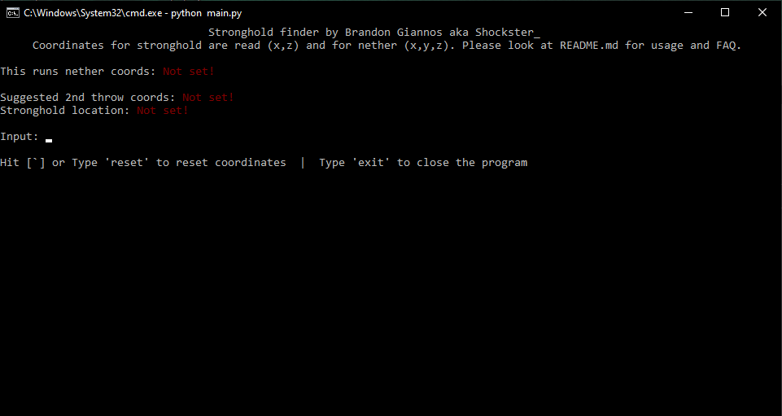

<h1 align="center">     Stronghold Finder</h1>

My personal Minecraft Stronghold finding tool using a triangulation algorithm released for community use.

<h3 align="center">
  <a href="#About">About</a> |
  <a href="#Installation">Installation</a> |
  <a href="#Usage">Usage |</a>
  <a href="#FAQ">FAQ</a>
</h3>

# About
Slight modification of @AlanTheBenign's stronghold finder to read directly from the clipboard. Also reads nether coords. All cases are meant for speedrunning. Any questions or concerns about the algorithm of the stronghold finder should be directed toward https://github.com/AlantheBenign/Minecraft-Stronghold-Finder.

# Installation
To use the program visit the release page [Here](https://github.com/Shockster218/Stronghold_Finder/releases/). Simply download the .zip file and extract the folder to, for exmaple, your desktop. Once that is done, all you have to do is run "Stronghold Finder.exe" and the program should start!

  

# Usage
Using the program is extremely simple, follow these steps in-game:

#### For nether
Simply copy the coordinates (refer to handy shortcuts below) and that's it!

#### For stronghold.
1. Make sure you are in an open area with a lot of room. Throw the eye of ender.
2. Make sure the eye of ender is at the end of it's animation. It will fly toward a specific direction, then go straight up in the air a bit and float. This is what you are looking for.
3. Make sure you are looking directly at the eye. Then, copy the coordinates (refer to handy shortcuts below).
4. Go to the suggested 2nd throw coordinates. Repeat steps 1-3.
5. You should have the stronghold coordinates! Be careful though, the coordinates may not be 100% accurate as slight variations from user input could offput the calculations by a few blocks. Make sure to listen for silverfish and dig around a bit! A third eye may be thrown to make sure of the stronghold location.

### Handy shortcuts
- F3 + C (in that order): Copy coordinates to clipboard for the program.
- "G" key: Reset the coordinates in the program.
- Typing "reset" in console: Reset the coordinates in the program.
- Type "exit" in console: Exits the program.

# FAQ 

### Why have an external program? Why not hook this directly into the client?
The reason this process is necessary is due to the guidelines and rules for speedrunning minecraft (found [here](https://docs.google.com/document/d/1A7NtP7LegD7SYjho54gQDSlJkYZlofndjw2COu00yMU/edit) ). You are not allowed to modify or tamper with the code of the client in any shape or form.

### Is this allowed for speedrunning?
Directly quoted from the speedrunning discord

> Q: Is a stronghold finder allowed?

>A: Yes, but no. Any stronghold/structure finder website that asks for seed input is not allowed. You are not allowed to use or see the seed of the world you’re in. However, stronghold calculators that take 2 angles as an input and locates the stronghold using math are allowed.

Since this program does not need nor ask for your seed, it is completely legal and follows speedrun guidelines.

### How accurate is the stronghold finder?
This stronghold finding algorithm is a rather reliable tool. The main issue here is user input variance. If you aren't looking directly at the eye, calculations could be off as it is crucial to get the proper angle. Out of many tests I have done (around 50 or so), the furthest I have been from a stronghold is about 10 blocks. Keep this in mind when using the tool!

### More to come in due time.